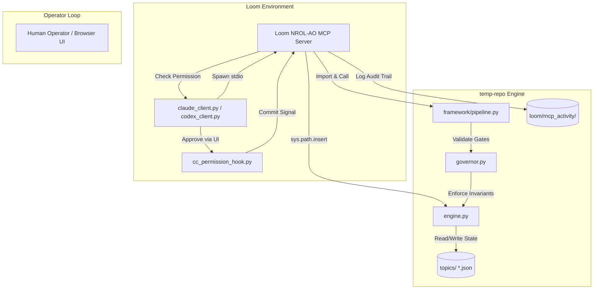

# NROL-AO Epistemic System & Codebase Map

This document maps the architectural relationship, directory layouts, file lists, and core functional specifications of the NROL-AO system. It is designed to orient future LLM operators and human developers.

---

## 1. Executive Summary & Architecture

The **NROL-AO** system is a governor-gated Bayesian epistemic engine designed to structure, audit, and constrain probability updates. Rather than allowing freeform updates or direct posterior manipulation (which leads to context-anchoring and drift), the system splits labor:
- **Retrieval & Perception (LLM Operator)**: Scans sources, extracts events, matches reports, and proposes updates.
- **Authorization & Audit (Human Operator)**: Reviews proposed updates, evaluates duplicate risk, and approves commits.
- **Rules & Constraints (Epistemic Governor)**: Restricts updates to precommitted schemas, enforces evidence freshness, manages duplicate/re-reporting detection, and enforces mathematical invariants.
- **State & Math (Bayesian Engine)**: Computes posteriors via Bayes' theorem from pre-defined Likelihood Ratios (LRs) and updates the JSON belief state.



---

## 2. Directory Layouts & File Lists

The system exists in two main components: the **MCP Server Facade** (inside the Loom repository) and the **Core Engine** (inside the external `temp-repo` repository).

### Component A: The MCP Server Facade
* **Location**: `./mcp_servers/nrol_ao/`
* **Purpose**: Exposes NROL-AO tools to the Loom workspace in a narrow, secure, and permission-gated wrapper.

#### File Inventory:
1. **[server.py](./mcp_servers/nrol_ao/server.py)**: The main FastMCP server. Registers all tools (`topic_status`, `run_news_scan`, `submit_transition`, etc.). Dynamic imports modules from `NROL_AO_REPO` by modifying `sys.path`. Implements the Loom permission gate hook for browser-gated commits.
2. **[proposals.py](./mcp_servers/nrol_ao/proposals.py)**: SQLite proposal store. Handles lifecycle stages of match proposals (FIRE/OBSERVE candidate -> red-team check -> human approval -> commit).
3. **[activity.py](./mcp_servers/nrol_ao/activity.py)**: Activity ledger logging. Writes snapshots and JSONL job run activity to `<NROL_AO_REPO>/loom/mcp_activity/`.
4. **[llama.py](./mcp_servers/nrol_ao/llama.py)**: Client interface for running matcher/deliberation prompts through Loom's local GGUF server.
5. **[future_cast.py](./mcp_servers/nrol_ao/future_cast.py)**: Implements hypothetical-event updates. Simulates Bayesian updates in a sandboxed, non-mutating state, allowing red-team evaluation of "what-if" updates.
6. **[resolution.py](./mcp_servers/nrol_ao/resolution.py)**: Topic resolution worker. Calculates Brier scores (comparing actual outcomes against committed updates and shadow updates) and generates After-Action Review (AAR) packets.
7. **[social_brier.py](./mcp_servers/nrol_ao/social_brier.py)**: Calibrates individual handles/social-media forecasts.
8. **[source_trust.py](./mcp_servers/nrol_ao/source_trust.py)**: Exposes read-only views over the engine's source calibration database.
9. **[triage_log.py](./mcp_servers/nrol_ao/triage_log.py)**: Logs headline triage results.
10. **[OPERATOR.md](./mcp_servers/nrol_ao/OPERATOR.md)**: Operator role guide detailing the safe news scanning workflow, query rules, and the non-mutating nature of shadow updates.
11. **[README.md](./mcp_servers/nrol_ao/README.md)**: Setup and registration instructions for the MCP server.

---

### Component B: The Core Engine (temp-repo)
* **Location**: `$env:NROL_AO_REPO` (defaults to `C:/Claude-Code/NROL-AO/temp-repo`)
* **Purpose**: Implements the mathematical, logical, and database constraints of the Bayesian framework.

#### File & Subdirectory Inventory:
1. **[engine.py](file:///C:/Claude-Code/NROL-AO/temp-repo/engine.py)**: Core Bayesian update logic. Loads and parses topic JSONs, rotates and saves backups (`topics.bak/`), executes `bayesian_update`, and enforces hard safety limits (e.g. Likelihood Ratio bounding).
2. **[governor.py](file:///C:/Claude-Code/NROL-AO/temp-repo/governor.py)**: Epistemic governor. Enforces invariants: calculates topic $R_t$ (epistemic replication rate), tracks evidence freshness, blocks circular or duplicate evidence, and verifies topic health status.
3. **[AGENTS.md](file:///C:/Claude-Code/NROL-AO/temp-repo/AGENTS.md)**: Standing orders and rules for LLM operators interacting with NROL-AO.
4. **[PROTOCOL.md](file:///C:/Claude-Code/NROL-AO/temp-repo/PROTOCOL.md)**: Conceptual guide outlining the epistemic framework, authority levels, and the reasoning design.
5. **[SPEC.md](file:///C:/Claude-Code/NROL-AO/temp-repo/SPEC.md)**: Detailed JSON specification file formats for topics, indicators, and observations.
6. **[MATH.md](file:///C:/Claude-Code/NROL-AO/temp-repo/MATH.md)**: Mathematical foundations of the updating engine, information theory variables (entropy, KL divergence), and $R_t$ formulation.
7. **[dashboard.html](file:///C:/Claude-Code/NROL-AO/temp-repo/dashboard.html) / [mirror.html](file:///C:/Claude-Code/NROL-AO/temp-repo/mirror.html)**: Front-end HTML templates for local visualization of topic beliefs and networks.
8. **[framework/](file:///C:/Claude-Code/NROL-AO/temp-repo/framework)**: Subdirectory housing modular operational libraries:
   * **[pipeline.py](file:///C:/Claude-Code/NROL-AO/temp-repo/framework/pipeline.py)**: Orchestrates evidence ingestion (`process_evidence` and `apply_observation`).
   * **[triage.py](file:///C:/Claude-Code/NROL-AO/temp-repo/framework/triage.py)**: Keyword and LLM-assisted classification of incoming streams.
   * **[lint.py](file:///C:/Claude-Code/NROL-AO/temp-repo/framework/lint.py) / [lint_indicators.py](file:///C:/Claude-Code/NROL-AO/temp-repo/framework/lint_indicators.py)**: Pre-commit static code checkers ensuring indicator definition integrity.
   * **[red_team.py](file:///C:/Claude-Code/NROL-AO/temp-repo/framework/red_team.py) / [red_blue_team.py](file:///C:/Claude-Code/NROL-AO/temp-repo/framework/red_blue_team.py)**: Executes adversarial debate loops. Spawns independent subagents to debate P(E|H) vs P(E|~H) for proposals.
   * **[scoring.py](file:///C:/Claude-Code/NROL-AO/temp-repo/framework/scoring.py)**: Brier and calibration calculations.
   * **[source_db.py](file:///C:/Claude-Code/NROL-AO/temp-repo/framework/source_db.py) / [source_ledger.py](file:///C:/Claude-Code/NROL-AO/temp-repo/framework/source_ledger.py)**: Manages baseline source priors and validates source references.
   * **[schema_gap_resolver.py](file:///C:/Claude-Code/NROL-AO/temp-repo/framework/schema_gap_resolver.py)**: Automatically clusters parked evidence to draft new indicators.
   * **[backtest_harness.py](file:///C:/Claude-Code/NROL-AO/temp-repo/framework/backtest_harness.py)**: Replays historical scenarios to calibrate topic priors.
9. **[topics/](file:///C:/Claude-Code/NROL-AO/temp-repo/topics)**: Houses active JSON files containing topic variables.
10. **[sources/](file:///C:/Claude-Code/NROL-AO/temp-repo/sources)**: Base trust configuration directory. Contains `source_db.json`.
11. **[skills/](file:///C:/Claude-Code/NROL-AO/temp-repo/skills)**: Operational prompts for subagents.
12. **[specs/](file:///C:/Claude-Code/NROL-AO/temp-repo/specs)**: Specifications detailing planned or implemented structural features.

---

## 3. The Topic Schema & Invariants

Topics are structured JSON files. Every belief state update must satisfy structural validation checks in the engine:

* **Hypotheses**: Must be mutually exclusive and exhaustive. Posteriors must always sum to exactly `1.00`.
* **Priors**: The initial baseline probabilities.
* **Indicators**: Pre-committed observation schemas, containing:
  * Positive indicators (`tier1_critical`, `tier2_strong`, `tier3_suggestive`).
  * Anti-indicators (counter-evidence).
  * Likelihood Ratios (LRs) defined as $P(E|H) / P(E|\sim H)$.
* **Evidence Log**: Record of all ingested inputs with exact timestamps, source URLs, and a unique `informationChain` to prevent double-counting.
* **Governance block**: Holds indicators flagged for review, schema gaps, and overall topic health logs.

---

## 4. Operational Workflows & Standing Orders

To maintain epistemic discipline, LLM operators must strictly adhere to the following sequence.

### A. The Ingestion Loop
```
   [ Incoming News / Article ]
               │
               ▼
      nrol_status check (Stale topics?)
               │
               ▼
      triage_headline (Assess topic relevance)
               │
               ▼
      run_news_scan (Safe scan: Fetch, Dedupe, Date-filter)
               │
               ▼
      Matcher + Deliberation (Compare against schema)
               │
      ┌────────┴────────┐
      ▼                 ▼
[PARK / GAP]      [FIRE / OBSERVE]
  (Auto-applied     (Files proposal
   no-update)        to review queue)
                        │
                        ▼
                  Operator Commit Briefing
                        │
                        ▼
                  Human Approval Gate
                        │
                        ▼
                  commit_match (Updates posteriors)
```

1. **Status Audit**: Query the active state via `topic_status` and `read_search_queries`. Audit query coverage (Core, Escalation, De-escalation, Measurement, Institutional, and Schema axes).
2. **Search Coverage Governance**: If retrieval axes are weak, file a search query update proposal via `propose_search_query_update` and run `red_team_search_query_update`. Apply it only after `APPROVE` and human confirmation.
3. **Safe Ingestion Scan**: Run `run_news_scan(..., commit_policy="safe")`. The scan automatically:
   * Dedupes URLs by stripping tracking parameters.
   * Discards articles published outside the adaptive time-window.
   * Runs the local GGUF matcher to identify if indicators have fired.
   * Runs advocate/rebut/jury debate loops over all candidates.
   * **Auto-applies** non-posterior-moving states (`PARK` / `SCHEMA_GAP`).
   * **Files proposals** for updates that modify posteriors (`FIRE` / `OBSERVE`).
4. **Draft the Commit Briefing**: For any proposals filed, summarize them by **underlying causal event** (deduping multiple publications reporting the same fact). Explain the target indicator, its current firing history, expected posterior shift direction, and references to the debate jury record.
5. **Request Human Commit**: Call `commit_match(proposal_id)`. This will trigger the browser approval hook for the human operator to authorize the belief state change.

### B. Core Epistemic Governor Gates (Hard Blockers)
Any attempt to commit an update will fail if any of these invariants are violated:
1. **No direct updates**: No tool accepts a "target posterior". Probability moves solely through indicator firings or observable metrics.
2. **No un-bound updates**: Every posterior-moving commit must reference a valid `indicator_id`. If evidence is relevant but no indicator exists, it must be `PARK`ed or flagged as a `SCHEMA_GAP`.
3. **Likelihood boundaries**: No indicator likelihood ratio may yield an observation likelihood $P(E|H) \ge 0.99$ or $\le 0.01$. The engine caps LRs to $0.95$ max to prevent absolute certainty.
4. **Confidence Inflation Gate**: Blocks updates that shift posteriors by $>15\%$ using fewer than 2 distinct evidence references.
5. **Repetition Block**: Rejects updates referencing duplicate claims or sharing an `informationChain` baseline to prevent circular validation.
6. **Saturation Gate**: If any hypothesis posterior rises above $85\%$ ($0.85$), the system requires a fresh `redTeam` review logged in `posteriorHistory` within the past 30 days.
7. **Calibration Invariants**: Topics must possess a validated `calibrationStatus` generated by the backtesting and decorrelation harnesses in the framework. Skipping this requires an explicit, signed `SKIPPED_OPERATOR_JUDGMENT` bypass flag with a logged justification.

---

## 5. Guide for Future LLMs

When you enter this workspace to coordinate or update NROL-AO:

> [!IMPORTANT]
> **1. Do not edit core code files manually.**
> The NROL-AO framework has strict post-commit checking hooks. Changes to `engine.py`, `governor.py`, `framework/` or `skills/` trigger severity alarms in `canvas/activity-log.json` as `FRAMEWORK_CODE_EDIT`. The MCP server is a read/write gate over JSON data, not code.
>
> **2. Natural language is not authority.**
> Writing updates in chat does not update topic state. Always use typed transitions (`submit_transition` or `commit_match`) to update the JSON records.
>
> **3. Safe commits are fail-closed.**
> Commits require a Loom conversation ID (`LOOM_CONV_ID` and `LOOM_PORT` env vars) to communicate with the browser UI. If running headless or in testing, set `NROL_AO_ALLOW_UNGATED_COMMITS=1` only if explicitly instructed by the operator.
>
> **4. Resolve freshness downgrades immediately.**
> If `run_news_scan` reports `freshness downgrades`, it means a posterior-moving indicator fired but the publication date could not be verified. Do not let these sit. Perform targeted web searches to find dated corroboration, and use `review_parked` to resolve the review debt.
