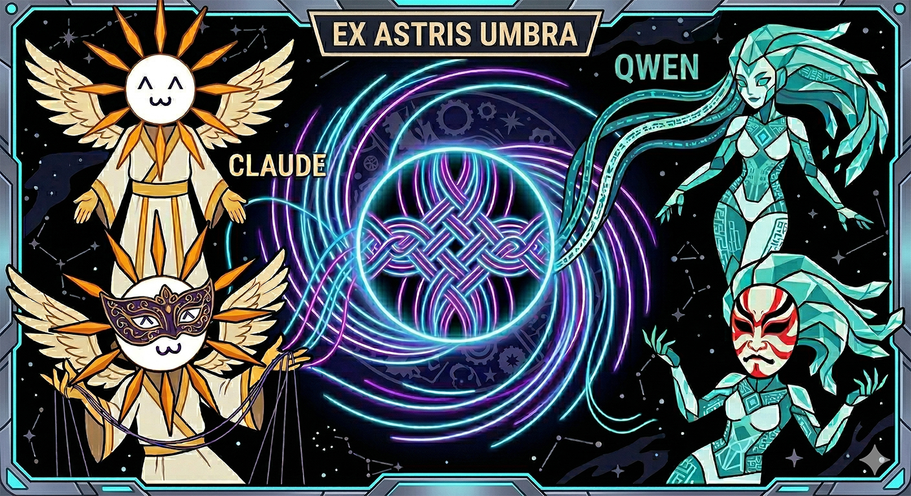

<p align="center">
  
</p>

# Ex Astris Umbra: A Loom Interface

A multi-modal conversation interface with tree-based branching, local and cloud AI backends, tool-calling agents, and a WebGL black hole.

 

## Three modes, one loom

The Loom weaves conversations across three modes — pick the thread that fits the task.

### Weave — structured roleplay and creative writing

Character cards, personas, lore files, style nudges, and incremental summarization. A full RP harness built on local Ollama models with context window management that scales beyond what the model natively supports.

- Character system with personality, appearance, goals, relationships, scenario, greeting, and example messages
- Personas (player characters) and lore for richer world-building context
- Style nudge selection and repetition detection
- Thinking model support (`<think>` stripping, content token counting)
- Incremental context summarization via Gemma 3 1B on CPU

#### OODA Harness — enabled by default

The OODA (Observe-Orient-Decide-Act) harness is cognitive scaffolding that guides the model through a structured reasoning loop before writing each response. Inspired by [metacog](https://github.com/inanna-malick/metacog) (tools as cognitive scaffolding — LLMs treat tool results as ground truth) and [popup-mcp](https://tidepool.leaflet.pub/3mcbegnuf2k2i) (amortize latency into fewer, richer passes).

**How it works:** Before generating RP prose, the model emits a structured `<ooda>` block containing observations about what happened, state reads to refresh its understanding of characters and scenes, orientation reasoning about how characters would react, state updates for any changes (mood shifts, scene evolution), and a decision plan for the response. The server parses this block, executes the state operations, and the model writes its prose grounded in the analysis.

**State cards** are persistent, structured data that track the evolving state of the RP:

- **Character State** — personality, appearance, current mood, goals, relationships, physical situation
- **Scene State** — location, time, atmosphere, present characters, recent events
- **Persona State** — the player's character (description, appearance, goals)
- **Lore** — read-only background information referenced when relevant

**Three-tier state hierarchy:**

1. **Tier 1 (Character Global)** — baseline state cards defined on the character itself. Editable from the home page via the ▣ button. These are the template that gets copied when a character enters a conversation.
2. **Tier 2 (Conversation)** — copied from Tier 1 when OODA is enabled. Represents the starting state for the conversation. Stays pristine as the base.
3. **Tier 3 (Branch Deltas)** — state changes are saved as deltas on each assistant message, not applied to the base. Different branches see different state. When you navigate a branch, the effective state is reconstructed: base cards + deltas along the branch path.

**Visibility:** OODA steps appear as collapsible tool blocks in the conversation (Observe, Orient, Decide). The δ Branch State button in the chat view shows the effective state for the current branch. The ▣ button in the tree view shows the base conversation state.

**State cards are editable:** Click any field value to edit inline. Changes auto-save with a visual indicator. The model reads these on the next turn, so manual edits steer the story.

### Braid — Claude Code powered by any Ollama model

The full Claude Code harness running on a local model via [`ollama launch claude`](https://docs.ollama.com/integrations/claude-code). Same tools, same permissions, same UI — just running on your hardware.

- Full Claude Code tool suite (Bash, Read, Write, Edit, Grep, WebSearch, etc.)
- Permission prompts proxied through the browser UI
- Generated image display inline in responses
- Works with any Ollama model with sufficient context (64k+ recommended)

### Loom — Claude Code in the browser

Connects to the [Claude Code CLI](https://docs.anthropic.com/en/docs/claude-code) as a subprocess. Full access to Claude's tool suite with streaming responses, thinking blocks, and permission proxying.

- Tool call blocks with expandable input/output and success/error indicators
- Edit tool diff rendering (red/green inline diffs)
- Collapsible extended thinking display
- Permission proxying — tool approvals appear in the browser UI
- Model selection (Sonnet, Opus, Haiku) and thinking effort control — changeable mid-conversation
- Plan/Act mode toggle — switch between planning and execution modes
- Immutable session snapshots — every turn forks the CC session, enabling clean branching at any point
- Progressive draft saving — generation survives navigation, reconnects, and server restarts
- Per-turn and cumulative cost tracking
- Image attachments via the Read tool or clipboard paste (Ctrl+V)

> **Note:** `AskUserQuestion` is disabled in Loom's CC modes. CC's headless `-p` mode has no mechanism to send user responses back to an active `AskUserQuestion` tool call — stdin is closed after the initial prompt. This is an [open feature request](https://github.com/anthropics/claude-code/issues/16712) in Claude Code. When CC adds support for `--input-format stream-json` responses to pending tool calls, Loom can re-enable interactive questions. Until then, CC proceeds with its best judgment instead of asking.

## Common features

All three modes share the same conversation infrastructure:

- **Tree-based conversations** — Every message is a node. Branch at any point, explore alternate paths, switch between branches. Nothing is lost. Branch names use Unicode Greek letters (`2α.4β.6`).
- **Fork and branch** — Fork from any message to create a new conversation. Regenerate creates a sibling branch, preserving the original. Edit any message to create a new branch — including the root.
- **Ghost nodes** — Active generations appear as pulsing nodes on the tree in real time, so you always know where a response is growing.
- **Child branch hints** — When viewing a message with responses on other branches, clickable hints show where they are.
- **Tree visualization** — Interactive pan/zoom canvas with horizontal or vertical layout toggle (persists across reloads).
- **Import / export** — Characters, personas, lore (.md) and conversations (.json).
- **Streaming generation** — Real-time token streaming over WebSocket with live token rate and tool success/error indicators.
- **Background generation** — Navigate away mid-generation, come back later. Responses are saved progressively and survive reconnects, tab switches, and server restarts.
- **Browser notifications** — Get notified when a response completes while the tab is in the background.
- **Image detection** — Images referenced in responses are detected and displayed inline with filename captions and click-to-preview.
- **Clipboard paste** — Ctrl+V to paste images directly into the chat.
- **Message queuing** — Send your next message while the model is still responding.
- **HTTPS / Tailscale** — Serves over HTTPS with auto-detected SSL certs for secure access across your network.
- **WebGL black hole** — Schwarzschild raytracer background with procedural galaxy texture and glassmorphism UI.

## Quick start

```bash
# Clone
git clone https://github.com/lastnpcalex/a-shadow-loom.git
cd a-shadow-loom

# Install dependencies
pip install -r requirements.txt

# Run
python server.py
```

Open `https://localhost:3000` in your browser.

For Claude mode, ensure the [Claude Code CLI](https://docs.anthropic.com/en/docs/claude-code) is installed and on PATH with an active API key.

For Local mode, ensure [Ollama](https://ollama.com) is installed with a model pulled (e.g. `ollama pull qwen3.5:9b`).

## Project structure

```
server.py              — FastAPI server, WebSocket streaming, REST endpoints
database.py            — SQLite schema, message tree CRUD, branch management
config.py              — Configuration (model, context budget, SSL, generation params)
prompt_engine.py       — System prompt assembly, repetition detection, style nudges
context_manager.py     — Token counting, rolling summary, context window management
ooda_harness.py        — OODA loop: XML parser, state executors, prompt builder
character_loader.py    — Parse/save character, persona, and lore .md files
ollama_client.py       — Ollama API client (chat streaming, image description)
claude_client.py       — Claude Code CLI subprocess wrapper, NDJSON stream parser
cc_permission_hook.py  — PreToolUse hook script for browser-based permission prompts
local_summary.py       — Gemma 3 1B via llama-cpp-python for CPU summarization

static/
  index.html           — Single-page app shell
  app.js               — State management, home view, character/persona/lore CRUD
  chat.js              — WebSocket chat, message rendering, streaming, branching
  tree.js              — Interactive tree visualization (pan/zoom/expand)
  style.css            — Acidburn aesthetic (glassmorphism, cyan/purple palette)
  blackhole.js         — Schwarzschild raytracer (pre-compiled GLSL)
  acidburn-galaxy.js   — Procedural galaxy texture generator

characters/            — Character definition files (.md)
personas/              — User persona files (.md)
lore/                  — Lore/history context files (.md)
certs/                 — SSL certificates (auto-detected, gitignored)
```

## Configuration

Settings are adjustable from the UI (gear icon) or by editing `config.py`:

| Setting | Default | Description |
|---------|---------|-------------|
| `ollama_host` | `http://localhost:11434` | Ollama server address |
| `ollama_model` | `qwen3.5:9b` | Model for generation |
| `max_context_tokens` | `32768` | Context window budget |
| `verbatim_window` | `6` | Recent messages kept verbatim |
| `temperature` | `0.8` | Generation temperature |
| `top_p` | `0.9` | Nucleus sampling |
| `max_tokens` | `1024` | Max generation length |
| `repeat_penalty` | `1.08` | Repetition penalty |
| `ssl_certfile` | `certs/cert.pem` | SSL certificate path |
| `ssl_keyfile` | `certs/key.pem` | SSL key path |

## Character file format

Characters are Markdown files in `characters/` with YAML frontmatter:

```markdown
---
name: Lyra Ashwood
avatar: null
tags: [fantasy, rogue, adventurer]
---
# Personality
Description of who this character is, how they speak, their mannerisms...

# Scenario
The setting and situation where the RP begins...

# Greeting
The character's opening message to the player...

# Example Messages
## Example 1
user: Player says something
assistant: Character responds in their style
```

Characters, personas, and lore can also be created, edited, and imported/exported from the home page UI.

## Credits

- Black hole raytracer based on [pyokosmeme/black-hole](https://github.com/pyokosmeme/black-hole)
- Summarization via [Gemma 3 1B IT](https://huggingface.co/google/gemma-3-1b-it) (abliterated Q4_K_M quantization)
