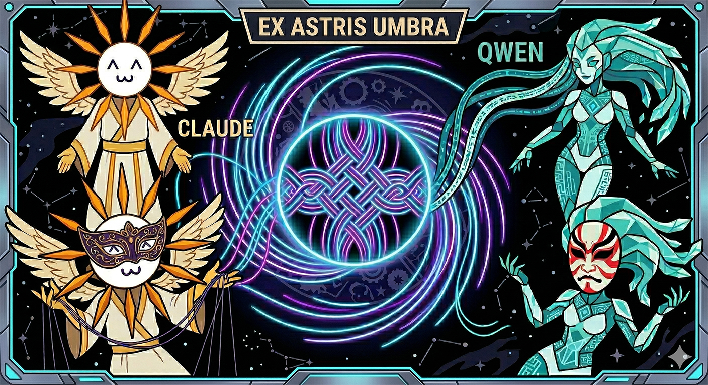

<p align="center">
  
</p>

# Ex Astris Umbra: A Shadow Loom


A self-hosted web interface for branching AI conversations across Claude Code, ChatGPT Codex, Antigravity (`agy`), Goose ACP, Hermes Agent, direct OpenRouter, Dream, and local llama.cpp models — and for handing off between them mid-conversation. Every conversation is a tree: branch, fork, regenerate, and full-text search across every path without losing anything.

## Project status and implementation model

A Shadow Loom is an active experimental project. The harnesses in this repo are
WIP operational integrations, not polished product SDK wrappers. Expect sharp
edges, frequent schema and workflow changes, and local state that may need
operator attention while features are being hardened.

The provider integrations are built around the tools you would run from a
terminal, not official application SDKs:

- **Claude** uses the Claude Code CLI as a subprocess.
- **Codex** uses the ChatGPT Codex CLI/app-server flow.
- **Antigravity/Gemini** uses the `agy` CLI.
- **Goose** uses Goose over ACP and can target OpenRouter, llama-server, or Dream.
- **OpenRouter** can also be used directly through the Claude Code-compatible shim.
- **Braid/Weave** use local `llama.cpp` / `llama-server`.
- **Hermes** uses Hermes Agent over ACP.
- **Dream Space** uses Hermes ACP against a DiffusionGemma sidecar.
- **NROL-AO** is operated through its typed MCP facade, with the engine repo as
  the authority boundary.

That design is deliberate: Loom is a branching UI, state store, permission
bridge, and orchestration layer around active agent tools. It does not replace
those tools' own auth/session behavior, and it does not guarantee that
experimental provider CLI behavior will remain stable.

The repository is the source-code boundary, not a backup of a running Loom
installation. A clone contains the server, UI, provider adapters, schema
migrations, tests, and default content. Git deliberately excludes credentials,
`config.json`, SQLite databases, uploads, generated workspaces, certificates,
local model binaries, provider home directories, and recovery artifacts.

## What is a loom?

An LLM loom treats every conversation as a **tree, not a thread**. Each message is a node. At any point you can branch — regenerate, edit, fork — and explore alternate paths without losing the originals. The metaphor comes from weaving: every response is a thread, and the loom holds them all in tension so you can compare, backtrack, and choose.

This matters because LLM output is non-deterministic. The same prompt can produce a brilliant answer on one roll and a mediocre one on the next. A linear chat hides that variance — you see one path and lose the rest. A loom preserves them all. Regenerate five times, keep the best, branch from the second-best later. Edit a message from ten turns ago and watch the conversation diverge. The tree is the conversation's real shape; a single thread is just one path through it.

## The point of the system

Different work wants different engines. Frontier Claude for hard problems, a local model for private or always-on work, an RP harness for creative writing, a locked-down operator for tasks where the model must not freelance. Normally each of those is a separate app with separate history, separate UI habits, and no way to move a conversation between them.

A Shadow Loom runs them all on one branching infrastructure: one database, one tree UI, one search index, one set of chat habits. Start a refactor on a frontier model, branch the conversation, rerun the branch on a local model, compare. Search across months of agent sessions regardless of which engine produced them. The loom is the constant; the engines are interchangeable shuttles.

## Six spaces, multiple provider lanes

### Loom — Claude Code in the browser

Connects to the [Claude Code CLI](https://docs.anthropic.com/en/docs/claude-code) as a subprocess. Full tool suite with streaming responses, thinking blocks, and permission proxying.

- Tool call blocks with expandable input/output and success/error indicators
- Edit tool diff rendering (red/green inline diffs)
- Collapsible extended thinking display
- Permission proxying — tool approvals appear in the browser UI
- A shared model picker for Anthropic, Antigravity/Gemini, ChatGPT Codex, Goose ACP, direct OpenRouter, Dream, and enabled compatibility providers — changeable mid-conversation
- Per-turn model attestation — the UI records the harness, requested model, launch model, effective model, evidence source, and verification level when the provider exposes them; configured-only and mismatch states remain visibly distinct from verified runtime evidence
- Thinking effort control for Anthropic and Codex models (`max` is Opus-only, `xhigh` is Opus/Codex)
- Plan/Act mode toggle
- Immutable session snapshots — every turn forks the CC session, enabling clean branching at any point
- Progressive draft saving — partial output survives navigation and reconnects; after a Loom host restart, an interrupted turn is retained or marked orphaned rather than silently resumed
- Per-turn and cumulative cost tracking
- Slash commands — Claude Code skills are scanned and exposed with autocomplete

### Braid — Claude Code on local models

The full Claude Code harness running against a local llama.cpp `llama-server`. Same tools, same permissions, same UI — just running on your hardware.

- Full Claude Code tool suite (Bash, Read, Write, Edit, Grep, etc.)
- Web search and page fetch via the bundled DuckDuckGo/trafilatura MCP server
- Permission prompts proxied through the browser UI
- Works with compatible tool-capable GGUFs and chat templates; 64k+ context is recommended

### Hermes — ACP agent on local models

[Hermes Agent](https://github.com/NousResearch) over the Agent Client Protocol, powered by the same local llama-server. A different agent architecture on the same loom: ACP session management, its own slash commands, permission requests bridged into the browser like CC's. Enable with `LOOM_ENABLE_HERMES=1`.

### Dream Space — Hermes ACP on DiffusionGemma

An opt-in Hermes space backed by Loom's Dream sidecar rather than llama-server.
It has separate model, context, diffusion-step, GPU, and idle-unload settings.
Enable the UI with `LOOM_ENABLE_DREAM=1` and configure the `DREAM_*` paths for
the local DiffusionGemma installation. The repository does not include that
sidecar or its model weights.

### Weave — structured roleplay and creative writing

Character cards, personas, lore files, style nudges, and incremental summarization. A full RP harness on local models with context management that scales beyond the model's native window.

- Character system with personality, appearance, goals, relationships, scenario, greeting, and example messages
- Personas (player characters) and lore for richer world-building context
- Style nudge rotation and repetition detection
- Thinking model support (`<think>` stripping, content token counting)
- Multi-branch generation — 1-5 parallel responses per turn, pick the best
- Backstage — a side conversation with an agent that edits state cards while the RP stays untouched

#### OODA Harness

The OODA (Observe-Orient-Decide-Act) harness is cognitive scaffolding that guides the model through a structured reasoning loop before writing each response. Inspired by [metacog](https://github.com/inanna-malick/metacog) (tools as cognitive scaffolding — LLMs treat tool results as ground truth) and [popup-mcp](https://tidepool.leaflet.pub/3mcbegnuf2k2i) (amortize latency into fewer, richer passes).

**The loop:** Before generating RP prose, the model emits a structured `<ooda>` block. The server parses it, executes the state operations against the database, and returns the results. The model then writes its prose grounded in fresh state reads rather than stale context.

1. **Observe** — read the current state of characters, scenes, and relationships from the database
2. **Orient** — reason about what changed, how characters would react, what the scene demands
3. **Decide** — plan the response: what happens, who speaks, what shifts
4. **Act** — execute state updates (mood changes, location shifts, relationship evolution) and write the prose

Each step appears as a collapsible tool block in the conversation, so you can see exactly what the model observed, how it reasoned, and what state it changed.

**State cards** track the evolving state of the RP — character state, scene state, persona state, and read-only lore — in a three-tier hierarchy:

1. **Tier 1 (Character Global)** — baseline cards defined on the character itself, editable from the home page. The template copied when a character enters a conversation.
2. **Tier 2 (Conversation)** — copied from Tier 1 when OODA is enabled. The pristine base state.
3. **Tier 3 (Branch Deltas)** — state changes are saved as deltas on each assistant message. Different branches see different state; navigating a branch reconstructs base cards plus deltas along the path.

State cards are editable inline — click any field to edit, changes auto-save, the model reads them next turn.

### NROL-AO — epistemic engine operator

A locked-down Claude Code profile for operating the NROL-AO forecasting engine. File and shell tools are stripped; the conversation can only act through the typed MCP interface (`mcp_servers/nrol_ao/`), which is the authority boundary: beliefs move through validated transitions, never freeform edits.

- Evidence flows through a proposal lifecycle — submit article, propose match, human-approved commit
- Scheduled scans with a safe commit policy: decisions that cannot move posteriors auto-apply, everything else queues for operator review
- Every scan writes a digest, so "nothing happened" is reported with the same weight as "something did"

## How the harnesses interoperate

The modes are different engines, but the loom around them is shared — which is what makes mid-conversation handoff work:

- **One tree, one store.** Every mode writes the same message-tree schema in SQLite. Branching, bookmarks, search, import/export, and the tree visualization don't care which engine produced a node.
- **Cross-provider switching.** A Loom conversation can move between Anthropic, Gemini, Codex, Goose, OpenRouter, Dream, and local models mid-conversation. Provider-native resume is allowed only at a compatible nearest-assistant boundary. A provider or model boundary forces a bounded rebuild from Loom's message tree instead of searching farther back for a stale native session.
- **Per-turn provenance.** Each assistant turn stores its harness/model attestation alongside the message. A green verified badge means Loom received runtime evidence from the harness or provider response; a configured or unverified badge is not presented as proof, and a mismatch is surfaced explicitly.
- **One chat surface.** Highlight-to-reply (select text in any message, quote it in your next send), attachments, image paste, message queuing, and slash commands work identically in every mode, because the excerpt and the attachments ride in the message itself rather than in provider-specific plumbing.
- **One permission surface.** Claude Code, Codex, Goose, and Hermes approvals are bridged into Loom's browser UI. Antigravity runs with provider-native approvals skipped so Loom remains the approval layer where the adapter supports it.
- **One canvas.** Any mode can drive the Interactive Canvas; the AI writes files, the iframe live-refreshes.

> **Note:** `AskUserQuestion` is disabled in CC modes. CC's headless `-p` mode has no mechanism to send user responses back to an active `AskUserQuestion` call — stdin is closed after the initial prompt ([open feature request](https://github.com/anthropics/claude-code/issues/16712)). Until then, CC proceeds with its best judgment instead of asking.

## Parallel agents and workspace integrity

Agent conversations with a working directory can opt into **Parallel agents in
same checkout**. This is shared-checkout concurrency, not automatic Git
worktrees: independent generations can run at the same time against the live
files, and each launch is tied to an explicit message-tree parent. The option
is off by default and is unavailable to Weave and NROL-AO operator
conversations.

Before each tool-capable provider turn, Loom takes a recovery snapshot of the
workspace outside the checkout and reports post-turn changes back to the UI.
Set `LOOM_WORKSPACE_RECOVERY_DIR` to choose that external storage location.
Snapshots preserve recovery blobs and expose churn; they do not serialize
agents, automatically merge conflicts, or authorize overwriting another
agent's work. Destructive Git operations still go through Loom's permission
flow.

## Search

Every message across every conversation is searchable from the home page. Type a query, get highlighted snippet results grouped by conversation, click to jump directly to the matching message on its branch.

This is particularly useful for **Claude Code sessions**. Loom mode stores every tool call, every thinking block, every response in SQLite — an indexed, searchable archive of your entire CC history that you can branch from at any point. Find that one-off bash command from two weeks ago, locate the conversation where you debugged that migration, pull up every time the agent touched a specific file.

There's also **per-conversation search** and **tree search** (find and navigate between matching nodes on the visual tree).

## Interactive Canvas

Any conversation can enable an **Interactive Canvas** — a live website (HTML/CSS/JS) rendered within the Loom UI that the AI builds and maintains through chat. Toggle it with the Canvas button.

The canvas appears as a **meta-root node** in the tree visualization — a glowing thumbnail positioned above all branch roots, connected by bezier curves. Click it to open the fullview, where the iframe fills the screen while the chat bar stays visible.

- Live refresh — when the AI writes to the `canvas/` directory, the iframe auto-updates via WebSocket
- Progressive LOD — the thumbnail blurs as you zoom out, with a pulsing beacon at maximum zoom
- Zero-config — enabling canvas auto-creates the workspace, a `canvas/CLAUDE.md` for the AI, and a `.gitignore`

### Canvas SDK

Canvas pages can talk back to Loom through a postMessage bridge:

```html
<script src="/static/canvas-sdk.js"></script>
<script>
  Loom.send("Update the chart with the latest data");
  Loom.uploadAndSend(file, "Analyze this CSV");
  const prompt = await Loom.loadTrigger('analyze', { filename: 'data.csv' });
  Loom.dropZone(element, { trigger: 'process' });
  Loom.on('canvas_updated', () => location.reload());
</script>
```

| Method | What it does |
|--------|-------------|
| `Loom.send(content, opts)` | Send a message and trigger generation. Options: `imagePaths`, `parentId` |
| `Loom.getConvId()` | Get the current conversation ID |
| `Loom.upload(file)` | Upload a file to the conversation |
| `Loom.uploadAndSend(file, content)` | Upload a file and send a message referencing it |
| `Loom.loadTrigger(name, vars)` | Load a prompt template from `canvas/triggers/{name}.md` with `{{variable}}` interpolation |
| `Loom.dropZone(element, opts)` | Wire drag-and-drop — uploads files and sends a trigger prompt |
| `Loom.on(event, handler)` | Listen for Loom events (`canvas_updated`, `message-sent`, ...) |

## Common features

All modes share the same conversation infrastructure:

- **Tree-based conversations** — every message is a node. Branch at any point, explore alternate paths, switch between branches. Branch names use Unicode Greek letters (`α2.β1.ε6`), extending to double/triple Greek for large trees.
- **Highlight to reply** — select text in any message bubble and a floating Reply button pins the excerpt above the input; the next send carries it as an attributed quote.
- **Fork and branch** — fork any message into a new conversation; regenerate creates a sibling branch; edit any message (including the root) to diverge.
- **Ghost nodes** — active generations appear as pulsing nodes on the tree in real time.
- **Tree visualization** — interactive pan/zoom canvas, horizontal or vertical layout.
- **Bookmarks** — bookmark any message or branch.
- **Streaming generation** — real-time token streaming over WebSocket with live token rate and tool indicators.
- **Background generation** — navigate away mid-generation and come back; responses save progressively and survive reconnects and tab switches. A host restart terminates the provider process, but persisted partial work is retained or marked as an orphaned generation.
- **Notifications** — bell dropdown for landed branches and permission requests; browser push when the tab is in the background.
- **Cron jobs** — schedule a script against a conversation on an interval; manage jobs from the admin dashboard.
- **Image handling** — clipboard paste, attachments, vision-model description for local modes, inline display of images the agent generates.
- **Message queuing** — send your next message while the model is still responding.
- **Per-tab state** — each browser tab remembers its own conversation and view.
- **HTTP or HTTPS / Tailscale** — binds `0.0.0.0`; HTTPS is enabled only when both configured certificate files exist, otherwise Loom starts over plain HTTP.
- **WebGL black hole** — Schwarzschild raytracer background with procedural galaxy texture and glassmorphism UI.

## Provider sessions and streaming recovery

- **Claude fork-every-turn** — Claude Code generations use `--resume <parent_session> --fork-session`. Each assistant message gets its own immutable native session snapshot.
- **Shared resume contract** — every provider stops at the nearest prior assistant boundary. Foreign, legacy-unscoped, errored, empty, or model-incompatible boundaries rebuild from bounded Loom history instead of reviving an older session.
- **Progressive drafts** — a draft message is created immediately, updated as text, thinking, tools, usage, and model attestation arrive, then finalized on stream end.
- **Reconnect recovery** — active in-memory generation snapshots rebuild the visible stream after WebSocket reconnects. Persisted database drafts preserve completed partial output across process failure, but the terminated provider process itself is not resumed after a host restart.

## Admin dashboard

A separate admin server (`admin_server.py`, port 3002) runs a single-page dashboard for operating the whole stack:

- **Overview** — Loom instance cards (start / restart / shutdown), active generation tracking with kill switches, live CPU/RAM/VRAM specs
- **Servers** — llama-server lifecycle with per-model launch config and a switch-model control, ComfyUI management, NROL-AO dashboard and MCP tools
- **Terminal** — a real web terminal ([ttyd](https://github.com/tsl0922/ttyd)) embedded in the page: PowerShell, cmd, or a Claude Code session. Binds localhost by default; `TTYD_HOST`/`TTYD_CRED` expose it over your tailnet.
- **Tools** — Claude auth status and OAuth refresh flow, VRAM cleanup, disk usage
- **Cron** — enable, disable, and archive scheduled jobs

llama-server is managed like a service: per-model context size, GPU layers, KV-cache quantization, flash attention, and mmproj are stored per GGUF and applied on launch, restartable from the Loom settings panel or the dashboard.

## Fresh-machine setup

The current deployment is developed and tested primarily on Windows with
Python 3.14. Python 3.12+ is the intended baseline. `requirements.txt` uses
minimum compatible versions; it is not an exact dependency lock file.

```powershell
# Clone
git clone https://github.com/lastnpcalex/a-shadow-loom.git
cd a-shadow-loom

# Create an isolated environment and install dependencies
python -m venv .venv
.\.venv\Scripts\python.exe -m pip install -r requirements.txt

# Run the main server
.\.venv\Scripts\python.exe server.py
```

On POSIX systems, use `.venv/bin/python` in place of
`.\.venv\Scripts\python.exe`; the admin tooling and current deployment remain
Windows-oriented.

Open the URL printed at startup. With no certificate files, the default is
`http://localhost:3000`; when both configured certificate files exist, it is
`https://localhost:3000`.

The base web application can start without every provider installed. Each
provider lane has its own runtime prerequisite:

| Lane or space | Runtime requirement |
|---------------|---------------------|
| Claude Code | Authenticated `claude` CLI on `PATH` |
| ChatGPT Codex | Authenticated `codex` CLI; Loom uses its app-server protocol |
| Antigravity | Authenticated `agy` CLI |
| Goose ACP | Goose installed (`goose` on `PATH` or `GOOSE_EXE`); enabled by default with `LOOM_ENABLE_GOOSE` |
| Direct OpenRouter | `OPENROUTER_API_KEY`; the optional management key enables usage/key-management features |
| Braid / Weave | `llama-server`, a compatible GGUF, and the appropriate chat template |
| Hermes | Hermes Agent plus `LOOM_ENABLE_HERMES=1`; optionally set `HERMES_HOME` or `HERMES_EXE` |
| Dream Space | DiffusionGemma sidecar/model plus `LOOM_ENABLE_DREAM=1` and the relevant `DREAM_*` paths |
| NROL-AO | A compatible engine checkout selected with `NROL_AO_REPO` |

For Braid, Weave, and local Hermes targets, point `llama_server_exe` and
`llama_models_dir` at the local installation in Settings → Advanced or
`config.json`, select a model, and launch llama-server from Loom or the admin
dashboard.

Loom injects the bundled `mcp_web_tools.py` server into supported local,
Goose, Hermes, and operator sessions. A global `claude mcp add` registration is
not required.

The optional admin dashboard runs separately:

```powershell
.\.venv\Scripts\python.exe admin_server.py
```

It prints either `http://localhost:3002` or `https://localhost:3002` depending
on whether the certificate files exist.

### What a clone does not reproduce

A fresh clone represents the tracked Loom code, but not the exact operational
state of an existing machine. Provision these separately when moving an
installation:

- `.env`, API credentials, provider authentication, and provider home/config directories
- `config.json` and machine-specific executable/model paths
- Loom SQLite databases, uploads, generated canvases, characters, personas, and lore
- SSL certificates, GGUF/model weights, llama-server, Dream, Hermes, Goose, Codex, Claude, and `agy` installations
- external repositories such as the `NROL_AO_REPO` engine checkout

Copy secrets through an appropriate secure channel, not through Git.

## Project structure

```
server.py              -- FastAPI server, WebSocket streaming, REST endpoints
database.py            -- SQLite schema, message tree CRUD, branch management
config.py              -- Configuration (llama-server, context budget, SSL, generation)
prompt_engine.py       -- System prompt assembly, repetition detection, style nudges
context_manager.py     -- Token counting, context window management
ooda_harness.py        -- OODA loop: XML parser, state executors, prompt builder
character_loader.py    -- Parse/save character, persona, and lore .md files
llama_client.py        -- llama-server client (OpenAI-compatible chat + vision)
claude_client.py       -- Claude Code CLI subprocess wrapper, NDJSON stream parser
codex_client.py        -- ChatGPT Codex app-server wrapper
gemini_client.py       -- Antigravity (agy) subprocess wrapper
goose_client.py        -- Goose ACP client and permission bridge
hermes_client.py       -- Hermes Agent ACP client and permission bridge
dream_client.py        -- Dream sidecar client
openrouter_client.py   -- Direct OpenRouter client, secrets, usage, and limits
provider_contract.py   -- Cross-provider native-session boundary rules
workspace_safety.py    -- External recovery snapshots and post-turn change reports
cc_permission_hook.py  -- PreToolUse hook for browser-based permission prompts
mcp_loom_workspace.py  -- Loom-gated file, shell, and sensitive-read MCP tools
mcp_web_tools.py       -- MCP stdio server: web_search + web_fetch for local models
mcp_servers/nrol_ao/   -- NROL-AO MCP server: typed transitions, proposals, scans
admin_server.py        -- Admin dashboard: instances, llama-server, ttyd, cron
static/
  index.html           -- Single-page app shell
  app.js               -- State management, home view, character/persona/lore CRUD
  chat.js              -- WebSocket chat, message rendering, streaming, branching
  tree.js              -- Interactive tree visualization
  style.css            -- Glassmorphism, cyan/purple palette
  blackhole.js         -- Schwarzschild raytracer (pre-compiled GLSL)
  admin/               -- Admin dashboard SPA

characters/            -- Character definition files (.md)
personas/              -- User persona files (.md)
lore/                  -- Lore/history context files (.md)
certs/                 -- SSL certificates (auto-detected, gitignored)
```

## Configuration

Persisted settings are adjustable from the UI (gear icon) or by editing the
gitignored `config.json`. Important source defaults include:

| Setting | Default | Description |
|---------|---------|-------------|
| `llama_host` | `http://localhost:8000` | llama-server address |
| `llama_model` | `Qwen3.6-27B-NVFP4.gguf` | Source fallback; select a model installed on your machine |
| `llama_server_exe` | `llama-server` | Path to the llama-server binary |
| `llama_models_dir` | `C:\LlamaServer\models` | Directory scanned for .gguf files |
| `max_context_tokens` | `32768` | Context window budget |
| `verbatim_window` | `6` | Recent messages kept verbatim |
| `temperature` | `0.8` | Generation temperature |
| `top_p` | `0.9` | Nucleus sampling |
| `max_tokens` | `16384` | Default output cap for direct local/helper calls |
| `weave_max_tokens` | `2048` | Weave output cap |
| `repeat_penalty` | `1.08` | Repetition penalty |
| `goose_model` | `goose:openrouter:z-ai/glm-5.2` | Default Goose selector |
| `dream_host` | `http://127.0.0.1:8787` | Dream sidecar endpoint |
| `db_path` | `loom.db` | SQLite database path |

Per-model llama-server tuning (context size, GPU layers, KV-cache quant, threads, batch sizes, mmproj, extra args) lives in `models_config.json` and is editable from Settings → Advanced.

Machine-specific and secret settings are environment variables rather than
tracked configuration:

| Environment variable | Purpose / default |
|----------------------|-------------------|
| `LOOM_PORT` | Main server port, default `3000` |
| `ADMIN_PORT` | Admin server port, default `3002` |
| `LOOM_DB` | Initial database path override |
| `LOOM_SSL_CERT`, `LOOM_SSL_KEY` | HTTPS certificate and key; both must exist to enable HTTPS |
| `LLAMA_HOST`, `LLAMA_MODEL`, `LLAMA_SERVER_EXE`, `LLAMA_MODELS_DIR` | Local llama-server connection and installation |
| `LOOM_ENABLE_GOOSE`, `GOOSE_EXE` | Goose visibility and executable override |
| `LOOM_ENABLE_HERMES`, `HERMES_HOME`, `HERMES_EXE` | Hermes enablement and installation |
| `LOOM_ENABLE_DREAM`, `DREAM_*` | Dream Space enablement and sidecar/model tuning |
| `OPENROUTER_API_KEY`, `OPENROUTER_MANAGEMENT_KEY` | Direct OpenRouter inference and optional account management |
| `NROL_AO_REPO` | External NROL-AO engine checkout |
| `LOOM_WORKSPACE_RECOVERY_DIR` | External workspace snapshot store |

## Character file format

Characters are Markdown files in `characters/` with YAML frontmatter:

```markdown
---
name: Lyra Ashwood
avatar: null
tags: [fantasy, rogue, adventurer]
---
# Personality
Description of who this character is, how they speak, their mannerisms...

# Scenario
The setting and situation where the RP begins...

# Greeting
The character's opening message to the player...

# Example Messages
## Example 1
user: Player says something
assistant: Character responds in their style
```

Characters, personas, and lore can also be created, edited, and imported/exported from the home page UI.

## Data safety

- **SQLite WAL mode** — Write-Ahead Logging for crash resilience
- **WAL checkpoint on shutdown** — the `/shutdown` endpoint checkpoints the WAL before closing
- **Graceful host lifecycle** — the admin dashboard requests `/shutdown` before starting a replacement instance; agents running inside Loom should leave host restart to the human/operator
- **Workspace recovery snapshots** — tool-capable agent turns preserve before/after file blobs outside the checkout and report deletions, large removals, and changes to files that were already dirty
- **Live workspace is canonical** — tracked-but-uncommitted and untracked files are real workspace state; snapshots are a recovery mechanism, not permission to restore from `HEAD`
- **Git excludes runtime state** — credentials, local config, databases, logs, uploads, certificates, provider settings, generated workspaces, and recovery outputs are ignored

## Validation

Run the complete test suite with:

```bash
python -m pytest
```

JavaScript files have no build step and can be syntax-checked directly:

```bash
node --check static/app.js
node --check static/chat.js
node --check static/tree.js
```

The NROL-AO integration and synthetic replay tests require a compatible,
syntactically valid external engine checkout at `NROL_AO_REPO`; failures in
that repository are not repaired by reinstalling Loom.

## Credits

- Black hole raytracer based on [pyokosmeme/black-hole](https://github.com/pyokosmeme/black-hole)
- OODA harness inspired by [metacog](https://github.com/inanna-malick/metacog) and [popup-mcp](https://tidepool.leaflet.pub/3mcbegnuf2k2i)
