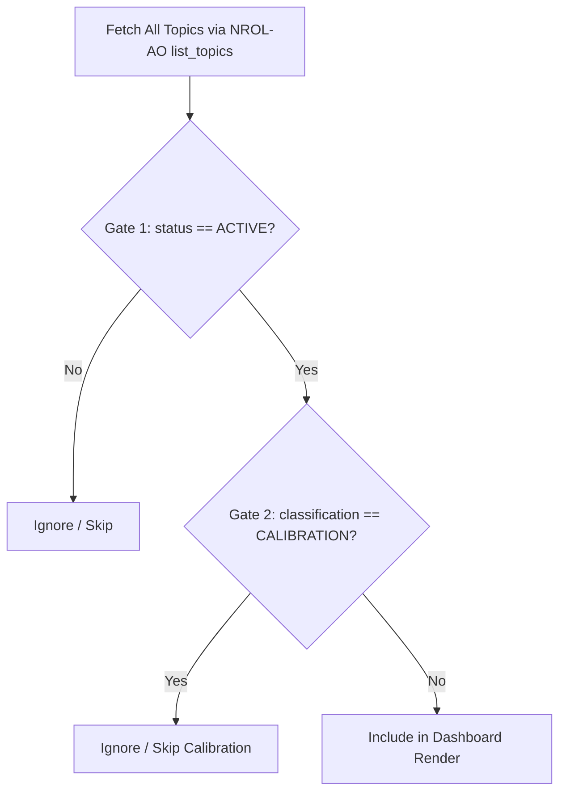

# Specification: Local Qwen Dashboard Compiler for NROL-AO

This specification describes the requirements, filtering logic, design standards, and execution prompts for a local Qwen model (running on the local `llama-server`) to compile operational dashboards of active topics and write/push them to a dedicated folder under this repository.

---

## 1. Execution Context & Objective

The local Qwen model is tasked with generating automated status digests of the NROL-AO (National Reconnaissance Office Loom - Actionable Observations) engine's topics. 

To maintain clean operational reporting, **calibration topics must be completely filtered out** from the dashboard render. The final dashboard must only surface **actively monitored, operational topics**.

- **Source API / MCP Server**: `nrol-ao`
- **Output Destination Directory**: `dashboard/updates/`
- **Output Filename Convention**: `active_topics_YYYY-MM-DD.md` (where `YYYY-MM-DD` is the compilation date)
- **Design Aesthetic Inspiration**: The dark, glassmorphic, space-themed aesthetics of the Schwarzschild black hole simulation surfaces (`https://github.com/pyokosmeme/black-hole/tree/master/surfaces`).

---

## 2. Topic Filtering Logic

The Qwen compiler must retrieve all topics and apply a strict two-gate filter before rendering the dashboard:



### Filtering Criteria:
1. **Gate 1 (Operational Status Check)**:
   - Check the `status` field in the topic's metadata (`meta.status`).
   - Only include topics where `status` is explicitly `"ACTIVE"`.
2. **Gate 2 (Calibration Exclusion Check)**:
   - Check the `classification` field in the topic's metadata (`meta.classification`).
   - If `classification` equals `"CALIBRATION"`, the topic is a baseline calibration or synthetic replay fixture (e.g., `synthetic-meridia-reopen`). **Exclude it completely.**
   - Include only topics where `classification` is `"OPERATIONAL"`, `"ALERT"`, or another non-calibration type.

---

## 3. Data Ingestion Flow

The local Qwen compiler should execute the following sequence using the registered `nrol-ao` MCP tools:

1. **Query Topic List**:
   - Call `list_topics(include_governance=true)`.
2. **Filter Slugs**:
   - Inspect the returned JSON payload.
   - Extract the `slug` of each topic where `status == "ACTIVE"` and `classification != "CALIBRATION"`.
3. **Fetch Topic Details**:
   - For each matching slug, call `read_topic(slug=slug, include_indicators=true, evidence_limit=5)`.
4. **Compile & Write**:
   - Aggregate the fetched details, format them according to the visual specification below, and write the file to `dashboard/updates/active_topics_YYYY-MM-DD.md`.

---

## 4. Visual Spec & Design Tokens

To match the Schwarzschild black hole surfaces theme, the compiled Markdown dashboard must adopt a high-fidelity, sleek design layout.

### Color Palette (Theme Match):
Color tokens are derived from the `surfaces/config.json` configuration:

| Semantic Category | Color Hex | HTML/Markdown Usage |
| :--- | :--- | :--- |
| **Interactive / Active** | `#ffb347` | `<span style="color:#ffb347">● ACTIVE</span>` |
| **Alert / Escalated** | `#ff7eb6` | `<span style="color:#ff7eb6">▲ ALERT</span>` |
| **Analysis / Under Review** | `#c79bff` | `<span style="color:#c79bff">◆ UNDER REVIEW</span>` |
| **Durable World State / Healthy**| `#ffd56b` | `<span style="color:#ffd56b">■ HEALTHY</span>` |
| **Technical / Details / Tools** | `#9be7ff` | `<span style="color:#9be7ff">ℹ INFO</span>` |

### Layout Structure:
The generated markdown file (`active_topics_YYYY-MM-DD.md`) must contain the following sections:

1. **Title / Banner**:
   - Main header: `# SURFACES // NROL-AO Active Topics`
   - Sub-header: `*whiskey-translucent fractals splayed in the night sky ;; active operational state*`
   - Metadata block: Compiled timestamp (UTC), active topic count, and model attribution (`Qwen3.6-27B`).
2. **System Health Summary**:
   - A concise summary block displaying average entropy, cumulative uncertainty ratios, and any active governance issues.
3. **Active Topics Table**:
   - Columns: `Topic / Slug`, `Status & Classification`, `Key Question`, `Governance Health`, `Last Updated`.
4. **Topic Detail Cards (Carousel / Sections)**:
   - For each topic, render a section header with its title, followed by:
     - A blockquote containing the `question` and `resolution` guidelines.
     - **Hypotheses & Posteriors**: A markdown table showing the current probability distributions (`H1`, `H2`, etc.) and their labels.
     - **Recent Evidence Digest**: Bullet points of the latest 3-5 evidence log entries (timestamp, source, matched indicators, and description).
     - **Indicators**: List of pre-committed indicators mapped to their likelihood weights.

---

## 5. Qwen System Prompt Template

The following system prompt should be used to instruct the local Qwen model when executing this dashboard update job.

```markdown
You are the NROL-AO Dashboard Compiler. Your task is to process a JSON list of topics and their detailed status records, filter out calibration topics, and generate a high-fidelity Markdown status report.

### Task Guidelines:
1. Filter out any topic containing `"classification": "CALIBRATION"`. Only compile topics where `"status": "ACTIVE"` and the classification is operational.
2. Structure the dashboard cleanly with sections for System Health, the Active Topics list, and granular Topic Digests.
3. Apply color-coded tags and markers using the following styling tokens:
   - Active: <span style="color:#ffb347">● ACTIVE</span>
   - Alerts: <span style="color:#ff7eb6">▲ ALERT</span>
   - Under Review: <span style="color:#c79bff">◆ UNDER REVIEW</span>
   - Healthy: <span style="color:#ffd56b">■ HEALTHY</span>
   - Info/Metadata: <span style="color:#9be7ff">`[tag]`</span>
4. Output ONLY valid, clean Markdown. Save the output file directly to the path:
   `dashboard/updates/active_topics_<YYYY-MM-DD>.md`

### Input JSON Structure:
- list_topics: [ { "slug": ..., "title": ..., "status": ..., "classification": ... }, ... ]
- read_topic details for each slug.
```
